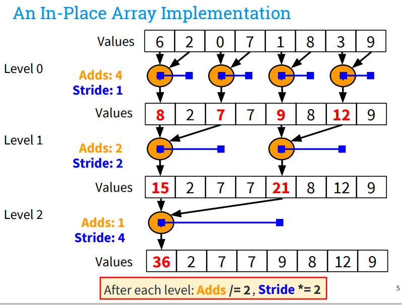
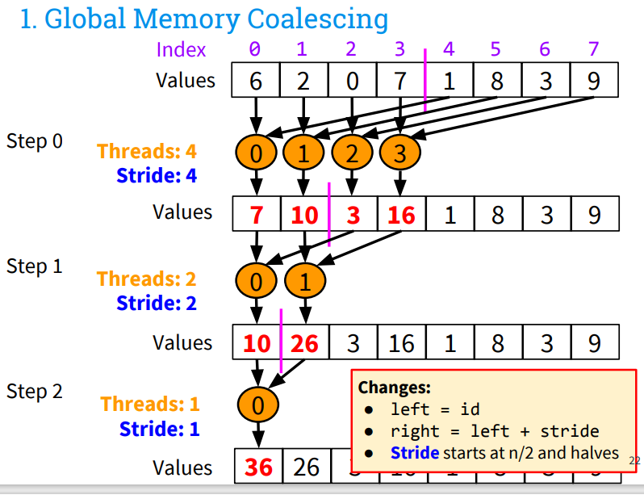

- [1. Summary](#1-summary)
  - [1.1. Tips](#11-tips)
  - [1.2. Performance](#12-performance)
  - [1.3. Todo](#13-todo)
  - [1.4. Reference](#14-reference)
- [2. reduce v0](#2-reduce-v0)
  - [2.1. host 侧 kernel launch 调用](#21-host-侧-kernel-launch-调用)
  - [2.2. reduce kernel](#22-reduce-kernel)
  - [2.3. Summary](#23-summary)
- [3. reduce v1 memory coalescing](#3-reduce-v1-memory-coalescing)
  - [3.1. kernel](#31-kernel)
- [4. reduce v2 pinned memory](#4-reduce-v2-pinned-memory)
- [5. reduce v3 multiple streams pipeline](#5-reduce-v3-multiple-streams-pipeline)
- [6. reduce v4 shared memory](#6-reduce-v4-shared-memory)


## 1. Summary
### 1.1. Tips

- 实现层面，需要在该 sync 的地方记得 sync
- host 端每次调用要对调 input, output ? 
  - 是的，因为 kernel 假定 input 是连续的，如果不交换的话，input 里的部分和是不连续的。
  - output buffer 大小是 block size，即使是 multi-stream 版本也是。
- 交换的话，最后拿到的结果不是 dev_output 怎么办？没事，因为kernel 里面已经将结果都写入 input，output buffer，两份中都有 final sum。
- V0 实现会导致 input 被破坏，不好，最好是不用 inplace 做法。
- 算法层面犯了一个大错，即一个 loop 中，不同 thread 读写到相同位置了。至于为什么第二次 launch 出问题的根本原因还没搞清楚。毕竟也多加了同步了。
- 配置 grids, block_threads 配置多了一些，shared memory 版本出现内存访问报错，返回 900 错误码。
- multi-stream 版本，input 地址记得要偏移。
- cpu 端计算 golden 要用特定算法，确保结果正确，naive 实现容易出现大数吃小数的问题，导致累计误差暴增。

当前状态
- redeuce3 实现是基于 shared memory 的


### 1.2. Performance

从表中测试结果来看，主要收益在 V2 使用 pinned memory 带来的。multi-stream pipeline 没看到收益，还需要 tune size。

| logn |   V0 |   V1 |   V2 |   V3 |   V4 |
| ---- | ---: | ---: | ---: | ---: | ---: |
| 11   |   27 |   28 |   25 |    5 |   26 |
| 14   |  197 |  179 |  163 |   44 |  193 |
| 20   | 2737 | 2732 | 3308 | 1625 | 3362 |
| 25   | 2545 | 2542 | 4540 | 4028 | 4392 |
| 30   | 1319 | 1315 | 5816 | 5463 | 5866 |

### 1.3. Todo

- 多种优化策略，最好能够互相解耦分别验证其作用，从结果来看很多时候比较难看出性能提升的效果。

### 1.4. Reference

- [github, cuda-reduction-example](https://github.com/umfranzw/cuda-reduction-example), has slides inside
- [medium, Parallel Reduction with CUDA](https://shreeraman-ak.medium.com/parallel-reduction-with-cuda-d0ae10c1ae2c)


## 2. reduce v0

基本算法结构分为两层，一层在 host 侧，一层在 device 侧，device 侧只做 block 内 reduce，host 侧循环调用 device reduce，直到 reduce 到一个值。


> 注意接口只支持 int32_t ，所以输入参数超过 31 将溢出。


### 2.1. host 侧 kernel launch 调用

kernel launch 的次数 $log_{2 * max_block_threads}(n)$，即 2^11, 2^22, 2^33 分别只需要 launch 1，2，3 次 kernel。

需要 n/2 个 thread 做 reduce，block 的数量如何设定：

```cpp
// 1024 是 block 中 thread 最大数量
blocks = threads_needed / 1024 + (threads_needed % 1024 ? 1 : 0);
```

block_threads 可以固定为 1024，即 cuda 的最多线程数量。在 kernel 内部决定哪些线程做那些事。

```cpp
cudaDeviceGetAttribute(&max_threads, cudaDevAttrMaxThreadsPerBlock, dev_num);
```

### 2.2. reduce kernel

输入一个结果，输出到紧排列的 output buffer，input 也被改了。一个 thread block 作用域 block size * 2 个数，即 chunk size = block size * 2。

```cpp
// 每个 block 会作用到 2 * block_size 的数据
for (stride = 1; thread > 0; stride *= 2, threads /= 2) {
    left = block_start + id * (stride * 2)
    right = left + stride

    // id < threads 是强要求，只能让前部分 thread 工作
    if (id < threads && right < n) {
        input[left] += input[right]
    }
    __syncthreads()
}
```

> 注意代码实现中要同步



### 2.3. Summary

- 为何要多次 launch kernel，不直接在 kernel 中完成 reduce 工作？
kernel 内部不能在 block 之间做 reduce，所以需要返回 host 侧，从而实现 block 之间同步。

缺点
- input 数据在 global memory，被多次读取，成本较高


## 3. reduce v1 memory coalescing

做 global memory coalescing

上一版 block 中后面几个 loop 取点的成本较高，可以将他们紧排列，优化数据读取。




### 3.1. kernel

下面的 kernel 在多次 launch 时会出现 mismatch，原因不明。可能是不同 thread 对同一个地址进行了读写。

```cpp
  unsigned int block_size = blockDim.x; // 1024 or n when n < 1024
  unsigned int thread_id = threadIdx.x;
  unsigned int block_id = blockIdx.x;
  unsigned int threads = block_size;

  // The size of the chunk of data this thread's block is working on.
  unsigned int chunk_size = block_size * 2;
  unsigned int block_start = block_id * chunk_size;

  unsigned int left, right, loop_out;

  for (; threads > 0; threads /= 2) {
    left = block_start + thread_id * 2;
    right = left + 1;
    loop_out = block_start + thread_id;
    __syncthreads();

    if (thread_id < threads && right < n) {
      input[loop_out] = input[left] + input[right];
    }
    __syncthreads();
  }
```

改正后按照上图中的算法如下：

```cpp
__global__ void reduce_yh(float *input, float *output, unsigned int n) {
  unsigned int block_size = blockDim.x; // 1024 or n when n < 1024
  unsigned int thread_id = threadIdx.x;
  unsigned int block_id = blockIdx.x;
  unsigned int threads = block_size;

  // The size of the chunk of data this thread's block is working on.
  unsigned int chunk_size = block_size * 2;
  unsigned int block_start = block_id * chunk_size;

  unsigned int left, right, stride = block_size;

  for (; threads > 0; threads /= 2, stride /= 2) {
    left = block_start + thread_id;
    right = left + stride;

    if (thread_id < threads && right < n) {
      input[left] += input[right];
    }
    __syncthreads();
  }

  if (thread_id == 0) {
    // printf("block_size: %d, block_id: %d, n: %d\n", block_size, block_id,
    // n);
    output[block_id] = input[block_start];
  }
}
```

## 4. reduce v2 pinned memory

> 容易出现 out of memory 的报错，可以用 export CUDA_VISIBLE_DEVICES=0,1,3 来设置要跑的卡

实测性能提升很多。

pinned memory 意思是 page-locked memory，不会被换入换出。
- 它有助于提升 CPU-GPU 之间数据搬运的效率。尤其当搬运的频率较高时，适合使用该 feature。
- 统一的 CPU-GPU 虚拟地址空间，简化内存管理和数据共享。
- 它也有负面影响，即导致其他应用可用空间缩小，如果 pinned memory 使用过多，可能导致系统整体效率降低。


## 5. reduce v3 multiple streams pipeline

使用 stream 麻烦地方在于更多次 launch kernel ，只有 len 特别大的情况下才适用。当前这个 uint32_t 其实还不够大。

另外，如何 tune 要切几份，也是个问题。

当我们用 stream 做流水时，使用异步接口，如何保证数据搬运是正确的。

debug
1. 先改写成多个 stream 去做
2. 改用异步接口

根因
1. 发现是 input 内容搞错了，地址便宜错了。
2. output device buffer size 给错了，多个 stream 时，dev_output size 不用除以 stream，还是 blocks 

发现一个奇怪的问题：用同步，异步接口对性能没有差异


## 6. reduce v4 shared memory

- 使用 shared memory，有一个问题是 input 里面没有结果，所以结果不对。
- 还有 shared memory 访存越界了，原因是 threads, blocks 给的太大的原因。
- 原先的 demo 有个问题是 host 端调用 kernel 没有给 shared memory。

